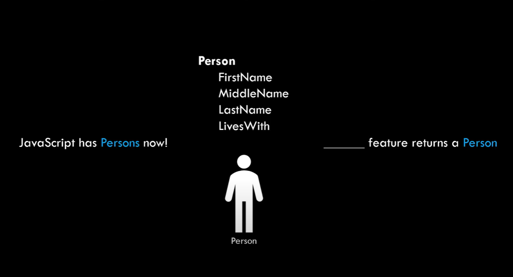
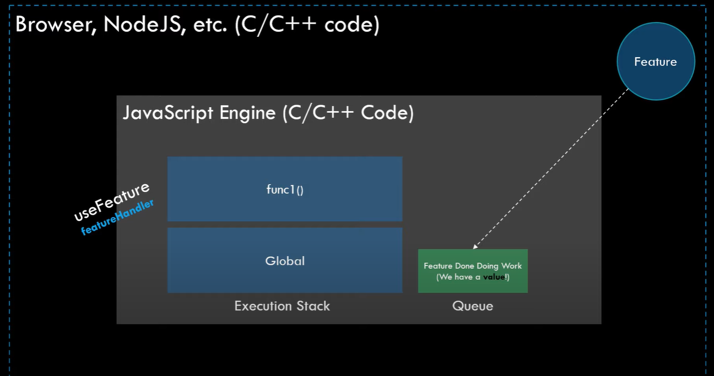

## Callback pattern

To understand promises, let's first start with the concept of `callback` functions. A function that is passed to another function that gets invoked by that function.
A common example is the callback passed to the `setTimeout` function like this:

```js
setTimeout(function () {
  console.log("Callback...");
}, 1000);
```

> **A quick recap of asynchronous code in JavaScript:** > `setTimeout` is an asynchronous function executed by the system in which JavaScript is embedded. Once that process is done, it will notify the JavaScript engine using what's known as `event queue` after which the engine can execute the corresponding handler.

This pattern of callback functions can get cumbersome soon enough. For example imagine the following scenario:

```js
setTimeout(function () {
  getPerson(function () {
    getLog(function () {
      // ...
    });
  });
}, 1000);
```

In this example, `getPerson` and `getLog` are asynchronous functions that will go over the internet to fetch some data. This code structure can be really hard to read and debug. But what's even more, it cannot handle some cases such as:

- when we have multiple handlers wanting to respond to that event (i.e. multiple callbacks)
- the case where we want to respond to an event later after a process is finished

These problems can be solved using pure JavaScript even external libraries, so it's not like JavaScript cannot handle those issues. But this pattern of callbacks doesn't handle these cases in a very readable and simple way.

## Enter promises

The resource explains the idea very well and these are some pictures of the resource:



